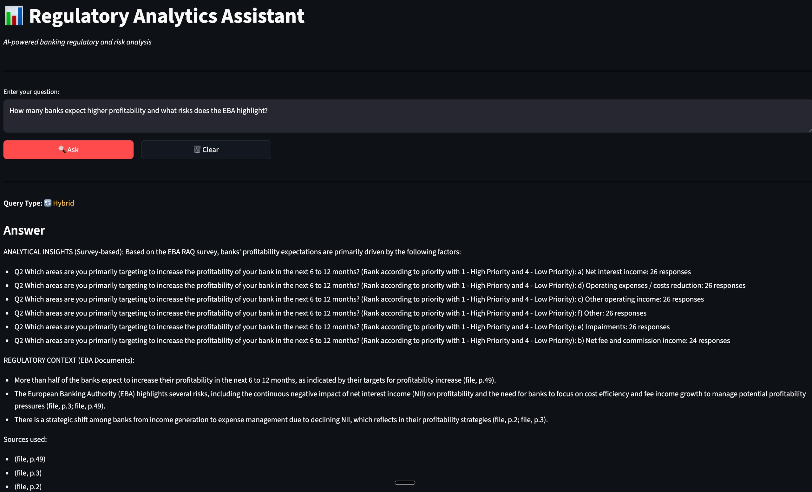
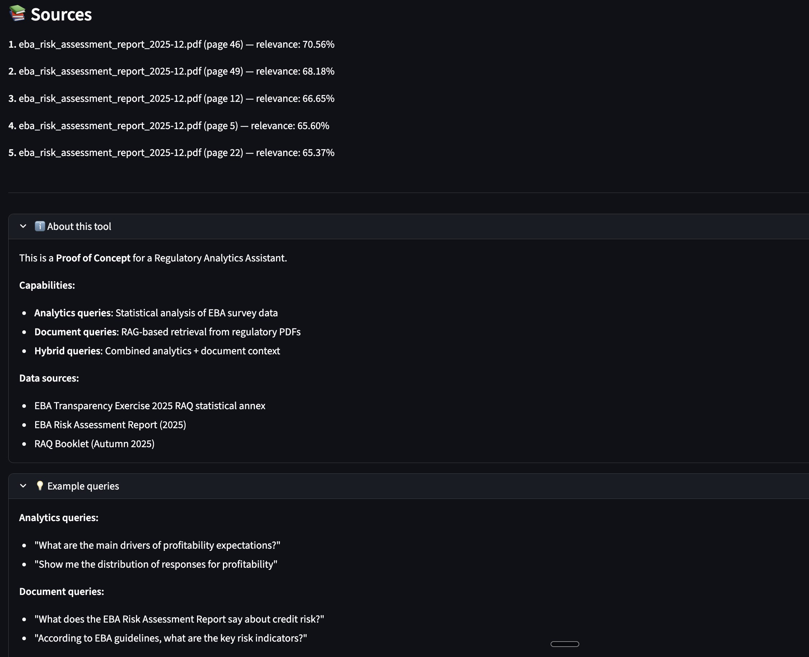

# Regulatory Analytics Assistant

**Proof-of-Concept** system for regulatory analytics in the EU banking domain, combining
structured survey data analysis with Retrieval-Augmented Generation (RAG) over regulatory documents.

<p align="center">
  
</p>

<p align="center">
  
</p>


## Overview

This AI system can:

- Answer **analytical questions** using structured EBA survey data (SQL-based)
- Answer **regulatory questions** using RAG over official EBA PDF documents
- Handle **hybrid queries** combining statistics and regulatory context
- Provide **transparent answers with source attribution**

The system is designed as a realistic POC following production-style architecture.


## Domain & Data

**Domain**
- EU banking regulation
- European Banking Authority (EBA)
- Risk Assessment Questionnaire (RAQ)
- Transparency Exercise 2025

**Structured data**
- EBA Transparency Exercise 2025 (RAQ statistical annex)
- Statistical Data Dictionary (SDD)

**Unstructured data**
- EBA Risk Assessment Report (2025)
- RAQ Booklet (Autumn 2025)


## System Capabilities

The system automatically classifies incoming queries into three types:

1. **Analytics**
   - SQL-based aggregation over survey results  
   - Example: *"What are the main profitability expectations of banks?"*

2. **Document**
   - RAG over regulatory PDFs  
   - Example: *"What risks does the EBA highlight for EU banks?"*

3. **Hybrid**
   - Combines structured analytics and regulatory context  
   - Example: *"How many banks expect higher profitability and what risks does the EBA mention?"*


## Architecture

- **Query classifier** routes requests to the correct pipeline
- **Analytics pipeline** executes SQL queries over PostgreSQL
- **RAG pipeline**
  - PDF chunking
  - Vector embeddings (pgvector)
  - Similarity search
  - LLM-based answer generation with citations
- **Hybrid pipeline** merges analytical results with document-based reasoning


## Tech Stack

- **Language**: Python 3.11+
- **Backend**: FastAPI
- **Database**: PostgreSQL 16 + pgvector
- **Data processing**: Pandas, SQLAlchemy
- **AI**: OpenAI API (embeddings & generation)
- **UI**: Streamlit
- **Infra**: Docker Compose
- **Testing**: Pytest
- **CI/CD**: GitHub Actions


## Project Structure
```text
app/
├── api/            # FastAPI endpoints
├── analytics/      # SQL-based analytics handlers
├── classification/ # Query classification
├── rag/            # Retrieval & generation
├── hybrid/         # Hybrid answering logic
├── ingestion/      # Data & document ingestion
├── evaluation/     # Retrieval evaluation
└── core/           # DB & OpenAI clients
```


## Running the Project

### 1. Start database
```bash
docker-compose up -d
```
### 2. Initialize schema
```bash
docker exec -i regulatory_analytics_db \
  psql -U postgres -d regulatory_analytics < docker/init.sql
```
### 3. Install dependencies
```bash
pip install -r requirements.txt
```
### 4. Set environment variables
```bash
export OPENAI_API_KEY=your_key_here
```
### 5. Run backend
```bash
uvicorn app.api.main:app --reload
```
### 6. Run UI
```bash
streamlit run ui/streamlit_app.py
```


## Evaluation

Basic retrieval quality is evaluated using Recall@K on known document chunks.
This provides a sanity check for vector search correctness in the RAG pipeline.


## Limitations (POC)

- Single-user, local setup
- Keyword-based query classification
- Simple chunking strategy
- No authentication or caching

